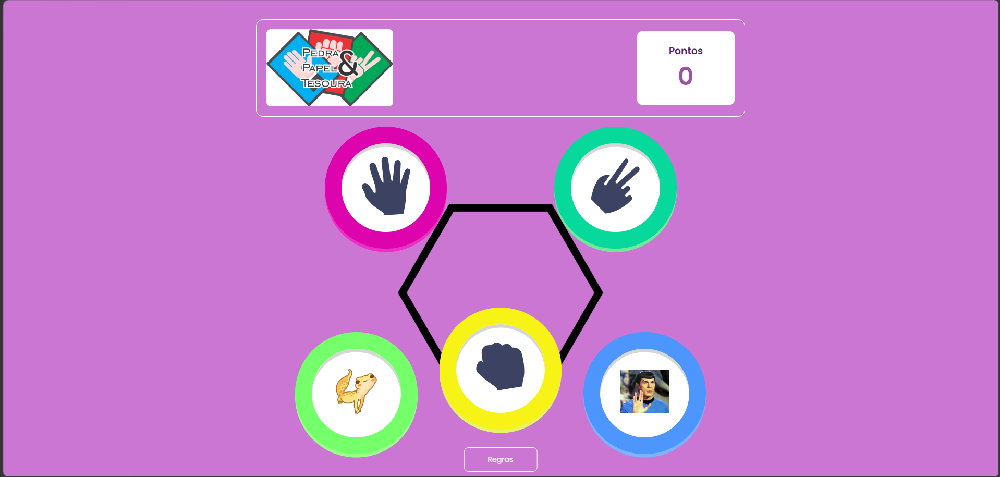

# 🪨📄✂️🦎🖖 Pedra, Papel, Tesoura, Lagarto e Spock

> A versão expandida do clássico Pedra, Papel e Tesoura — agora com 5 elementos e muito mais estratégia!



---

## 🎮 Sobre o projeto

Este é um jogo de **Pedra, Papel, Tesoura, Lagarto e Spock** desenvolvido com HTML, CSS e JavaScript puro. A variante foi popularizada pela série *The Big Bang Theory* e adiciona dois novos elementos ao jogo clássico, reduzindo as chances de empate e tornando as partidas mais imprevisíveis.

---

## ✨ Funcionalidades

- 🖱️ Interface interativa e responsiva
- 🤖 Adversário controlado pelo computador (escolha aleatória)
- 🏆 Placar em tempo real
- 🎬 Animações de transição entre telas
- 📜 Tela de regras com diagrama visual
- 🔄 Botão para jogar novamente

---

## 🕹️ Como jogar

1. Clique em um dos **5 botões** para fazer sua escolha:
   - 🪨 Pedra
   - 📄 Papel
   - ✂️ Tesoura
   - 🦎 Lagarto
   - 🖖 Spock
2. O computador faz a sua escolha automaticamente.
3. O resultado aparece na tela: **Você Ganhou**, **Empate** ou **Você Perdeu**.
4. Sua pontuação é atualizada a cada vitória.
5. Clique em **"Jogar Novamente"** para uma nova rodada.
6. Clique no botão **"Regras"** para ver o diagrama completo de quem vence quem.

---

## 📐 Regras do jogo

Cada elemento vence dois outros:

| Escolha  | Vence contra         |
|----------|----------------------|
| ✂️ Tesoura | 📄 Papel e 🦎 Lagarto |
| 📄 Papel   | 🪨 Pedra e 🖖 Spock   |
| 🪨 Pedra   | 🦎 Lagarto e ✂️ Tesoura |
| 🦎 Lagarto | 🖖 Spock e 📄 Papel   |
| 🖖 Spock   | ✂️ Tesoura e 🪨 Pedra  |

---

## 🗂️ Estrutura do projeto

```
📁 projeto/
├── index.html       # Estrutura da página
├── style.css        # Estilos e animações
├── script.js        # Lógica do jogo
└── images/
    ├── logogame.png
    ├── hexagono.png
    ├── icon-paper.svg
    ├── icon-scissors.svg
    ├── icon-rock.svg
    ├── lagarto.jpeg
    ├── spock.jpg
    ├── icon-close.svg
    └── regras.jpg
```

---

## 🚀 Como executar

Não precisa instalar nada! Basta abrir o arquivo `index.html` diretamente no seu navegador:

```bash
# Clone o repositório
git clone https://github.com/mariaeduardaurbano/pedrapapeltesoura.git

# Entre na pasta
cd pedra-papel-tesoura

# Abra no navegador
open index.html  # macOS
start index.html # Windows
xdg-open index.html # Linux
```

---

## 🛠️ Tecnologias utilizadas

- **HTML5** — estrutura da página
- **CSS3** — estilização, animações e layout responsivo
- **JavaScript** — lógica do jogo e manipulação do DOM
- **Google Fonts** — fonte [Poppins](https://fonts.google.com/specimen/Poppins)

---

## 👨‍💻 Autor

Feito com 💜 por **mariaeduardaurbano**! Sinta-se à vontade para melhorar, compartilhar e se divertir.

